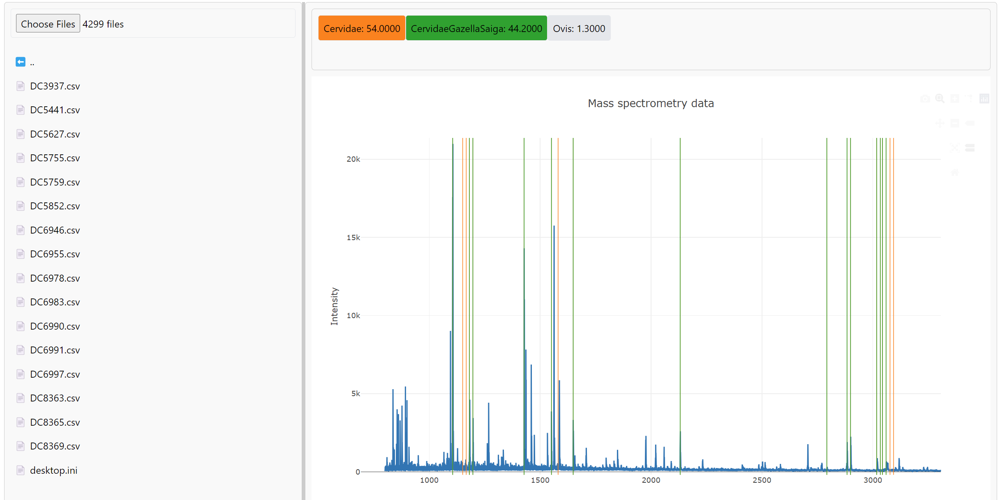

# zoomsweb
## Web application for ZooMS analysis with machine learning



The app is deployed at https://zoomsweb-b884f28c1db2.herokuapp.com/.

To install the app locally, run the following commands in the terminal:
```bash
git clone git@github.com:mlcolab/zoomsweb.git
cd zoomsweb
python install . -e
```

To host the web app locally, run the following command in the terminal:
```bash
zoomsweb
```

and open the link from the terminal in the browser.
